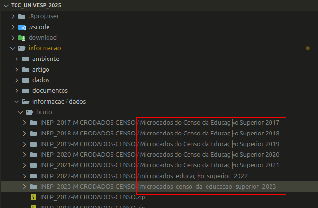

tree -L 3
.
├── allfiles.txt
├── ambiente
│   ├── ambiente.yml
│   └── requisitos.txt
├── artigo
│   ├── manuscrito
│   │   ├── artigo.docx
│   │   ├── figuras
│   │   ├── referencias
│   │   └── secoes
│   └── submissao
│       ├── artigo_final.docx
│       └── checklist_submissao.pdf
├── dados
│   ├── bruto
│   │   ├── INEP_2009-MICRODADOS-CENSO
│   │   ├── INEP_2009-MICRODADOS-CENSO.zip
│   │   ├── INEP_2010-MICRODADOS-CENSO
│   │   ├── INEP_2010-MICRODADOS-CENSO.zip
│   │   ├── INEP_2011-MICRODADOS-CENSO
│   │   ├── INEP_2011-MICRODADOS-CENSO.zip
│   │   ├── INEP_2012-MICRODADOS-CENSO
│   │   ├── INEP_2012-MICRODADOS-CENSO.zip
│   │   ├── INEP_2013-MICRODADOS-CENSO
│   │   ├── INEP_2013-MICRODADOS-CENSO.zip
│   │   ├── INEP_2014-MICRODADOS-CENSO
│   │   ├── INEP_2014-MICRODADOS-CENSO.zip
│   │   ├── INEP_2015-MICRODADOS-CENSO
│   │   ├── INEP_2015-MICRODADOS-CENSO.zip
│   │   ├── INEP_2016-MICRODADOS-CENSO
│   │   ├── INEP_2016-MICRODADOS-CENSO.zip
│   │   ├── INEP_2017-MICRODADOS-CENSO
│   │   ├── INEP_2017-MICRODADOS-CENSO.zip
│   │   ├── INEP_2018-MICRODADOS-CENSO
│   │   ├── INEP_2018-MICRODADOS-CENSO.zip
│   │   ├── INEP_2019-MICRODADOS-CENSO
│   │   ├── INEP_2019-MICRODADOS-CENSO.zip
│   │   ├── INEP_2020-MICRODADOS-CENSO
│   │   ├── INEP_2020-MICRODADOS-CENSO.zip
│   │   ├── INEP_2021-MICRODADOS-CENSO
│   │   ├── INEP_2021-MICRODADOS-CENSO.zip
│   │   ├── INEP_2022-MICRODADOS-CENSO
│   │   ├── INEP_2022-MICRODADOS-CENSO.zip
│   │   ├── INEP_2023-MICRODADOS-CENSO
│   │   ├── INEP_2023-MICRODADOS-CENSO.zip
│   │   └── lista-links.txt
│   ├── externo
│   ├── intermediario
│   │   ├── dados_cursos_tratado_2009.csv
│   │   ├── dados_cursos_tratado_2010.csv
│   │   ├── dados_cursos_tratado_2011.csv
│   │   ├── dados_cursos_tratado_2012.csv
│   │   ├── dados_cursos_tratado_2013.csv
│   │   ├── dados_cursos_tratado_2014.csv
│   │   ├── dados_cursos_tratado_2015.csv
│   │   ├── dados_cursos_tratado_2016.csv
│   │   ├── dados_cursos_tratado_2017.csv
│   │   ├── dados_cursos_tratado_2018.csv
│   │   ├── dados_cursos_tratado_2019.csv
│   │   ├── dados_cursos_tratado_2020.csv
│   │   ├── dados_cursos_tratado_2021.csv
│   │   ├── dados_cursos_tratado_2022.csv
│   │   ├── dados_cursos_tratado_2023.csv
│   │   ├── dados_ies_tratado_2009.csv
│   │   ├── dados_ies_tratado_2010.csv
│   │   ├── dados_ies_tratado_2011.csv
│   │   ├── dados_ies_tratado_2012.csv
│   │   ├── dados_ies_tratado_2013.csv
│   │   ├── dados_ies_tratado_2014.csv
│   │   ├── dados_ies_tratado_2015.csv
│   │   ├── dados_ies_tratado_2016.csv
│   │   ├── dados_ies_tratado_2017.csv
│   │   ├── dados_ies_tratado_2018.csv
│   │   ├── dados_ies_tratado_2019.csv
│   │   ├── dados_ies_tratado_2020.csv
│   │   ├── dados_ies_tratado_2021.csv
│   │   ├── dados_ies_tratado_2022.csv
│   │   └── dados_ies_tratado_2023.csv
│   └── processado
│       ├── dados_cursos_2009.csv
│       ├── dados_cursos_2010.csv
│       ├── dados_cursos_2011.csv
│       ├── dados_cursos_2012.csv
│       ├── dados_cursos_2013.csv
│       ├── dados_cursos_2014.csv
│       ├── dados_cursos_2015.csv
│       ├── dados_cursos_2016.csv
│       ├── dados_cursos_2017.csv
│       ├── dados_cursos_2018.csv
│       ├── dados_cursos_2019.csv
│       ├── dados_cursos_2020.csv
│       ├── dados_cursos_2021.csv
│       ├── dados_cursos_2022.csv
│       ├── dados_cursos_2023.csv
│       ├── dados_cursos_serie_temporal.csv
│       ├── dados_cursos_tratado_2009.csv
│       ├── dados_cursos_tratado_2010.csv
│       ├── dados_cursos_tratado_2011.csv
│       ├── dados_cursos_tratado_2012.csv
│       ├── dados_cursos_tratado_2013.csv
│       ├── dados_cursos_tratado_2014.csv
│       ├── dados_cursos_tratado_2015.csv
│       ├── dados_cursos_tratado_2016.csv
│       ├── dados_cursos_tratado_2017.csv
│       ├── dados_cursos_tratado_2018.csv
│       ├── dados_cursos_tratado_2019.csv
│       ├── dados_cursos_tratado_2020.csv
│       ├── dados_cursos_tratado_2021.csv
│       ├── dados_cursos_tratado_2022.csv
│       ├── dados_cursos_tratado_2023.csv
│       ├── dados_ies_2009.csv
│       ├── dados_ies_2010.csv
│       ├── dados_ies_2011.csv
│       ├── dados_ies_2012.csv
│       ├── dados_ies_2013.csv
│       ├── dados_ies_2014.csv
│       ├── dados_ies_2015.csv
│       ├── dados_ies_2016.csv
│       ├── dados_ies_2017.csv
│       ├── dados_ies_2018.csv
│       ├── dados_ies_2019.csv
│       ├── dados_ies_2020.csv
│       ├── dados_ies_2021.csv
│       ├── dados_ies_2022.csv
│       ├── dados_ies_2023.csv
│       ├── dados_ies_tratado_2009.csv
│       ├── dados_ies_tratado_2010.csv
│       ├── dados_ies_tratado_2011.csv
│       ├── dados_ies_tratado_2012.csv
│       ├── dados_ies_tratado_2013.csv
│       ├── dados_ies_tratado_2014.csv
│       ├── dados_ies_tratado_2015.csv
│       ├── dados_ies_tratado_2016.csv
│       ├── dados_ies_tratado_2017.csv
│       ├── dados_ies_tratado_2018.csv
│       ├── dados_ies_tratado_2019.csv
│       ├── dados_ies_tratado_2020.csv
│       ├── dados_ies_tratado_2021.csv
│       ├── dados_ies_tratado_2022.csv
│       ├── dados_ies_tratado_2023.csv
│       ├── dados_ingresso_evasao_conclusao.csv
│       ├── dados_transfer_learning_clean.csv
│       ├── dados_transfer_learning.csv
│       ├── dados_transfer_normalizado.csv
│       ├── dados_transfer_padronizado.csv
│       ├── entrada_modelos.csv
│       ├── dados_transfer_learning_clean.csv
│       ├── dados_transfer_learning.csv
│       ├── dados_transfer_normalizado.csv
│       ├── dados_transfer_padronizado.csv
│       ├── entrada_modelos.csv
│       ├── final_administracao.csv
│       ├── final_direito.csv
│       ├── final_eng_civil.csv
│       ├── final_ingressantes.csv
│       └── final_medicina.csv
├── documentos
│   ├── diagramas
│   │   ├── disclaimer_folders.png
│   │   └── fluxo_dados.png
│   └── graficos
│       ├── administracao.png
│       ├── direito.png
│       ├── engenharia_civil.png
│       ├── medicina.png
│       ├── taxa_evasao_administracao.html
│       ├── taxa_evasao_administracao.png
│       ├── taxa_evasao_administração.png
│       ├── taxa_evasao_administração.png
│       ├── taxa_evasao_direito.html
│       ├── taxa_evasao_direito.png
│       ├── taxa_evasao_eng_civil.html
│       ├── taxa_evasao_eng_civil.png
│       ├── taxa_evasao_engenharia_civil.png
│       ├── taxa_evasao_engenharia_civil.png
│       ├── taxa_evasao_medicina.html
│       └── taxa_evasao_medicina.png
├── LEIAME.md
├── LICENCA
├── log_erros.txt
├── modelos
│   ├── base_modelo_neural.h5
│   ├── base_modelo_neural.h5
│   ├── modelos_salvos
│   │   ├── modelo_finetuned_tcc.h5
│   │   ├── modelo_finetuned_tcc.h5
│   │   └── modelo_melhor_evasao.pkl
│   └── resultados_modelos
│       ├── matriz_confusao.png
│       ├── metricas_modelos.txt
│       └── metricas.txt
├── pyhton.py
├── pyhton.py
├── README.md
├── relatorios
│   ├── appendice_scripts_codigo_fonte.docx
│   ├── appendice_scripts_codigo_fonte.docx
│   ├── figuras
│   │   ├── distribuicao_taxa_evasao.png
│   │   ├── figura1.png
│   │   ├── figura2.png
│   │   ├── grafico_ingressantes_vs_concluintes.png
│   │   ├── grafico_mapa_calor_correlacoes.png
│   │   ├── grafico_taxa_conclusao.png
│   │   ├── grafico_taxa_evasao_modalidade.png
│   │   └── grafico_taxa_ingresso.png
│   ├── logs
│   │   └── log_treinamento.txt
│   ├── relatorio_analitico_final.docx
│   ├── relatorio_analitico_final.docx
│   ├── relatorio_analitico_final.pdf
│   └── tabelas
│       └── tabela1.csv
├── requisitos.txt
├── resultados
│   ├── comparacao_modelos_dispersao.png
│   ├── comparacao_modelos_linha.png
│   └── validacao_temporal_comparacao.png
├── scripts
│   ├── analises
│   │   ├── analises.py
│   │   ├── analises.R
│   │   ├── comparar_modelos.py
│   │   ├── from tensorflow.keras.models import load_model  modelo_h5 = load_model('modelos
│   │   ├── prever_com_modelos.py
│   │   ├── resumir_modelo_h5.py
│   │   └── validar_modelos_temporais.py
│   ├── coleta_dados
│   │   ├── coleta_dados_oficiais.py
│   │   └── coletar_links_inep.py
│   ├── dashboard
│   │   └── app_evasao.py
│   ├── modelagem
│   │   ├── gerar_base_modelo.py
│   │   ├── treinamento_modelo_C4.5_Tree_J48.py
│   │   ├── treinamento_modelo_Feature-based.py
│   │   ├── treinamento_modelo_Fine-tuning.py
│   │   └── treinamento_modelo_original.py
│   ├── processamento_dados
│   │   ├── pre_processamento_Transfer_Learn.py
│   │   ├── pre_processamento.py
│   │   ├── preparar_entrada_modelos.py
│   │   └── processamento_dados
│   ├── relatorio
│   │   ├── apendices_scripts.py
│   │   └── gerar_relatorio_pdf.py
│   └── visualizacao
│       ├── comparar_predicoes_cursos.py
│       └── gerar_graficos.py
└── scripts_modificados_0805.txt


# Análise de Dados Acadêmicos de IES Públicas 

Este projeto tem como objetivo desenvolver uma aplicação para análise de dados acadêmicos (ingresso, conclusão e evasão de alunos) de Instituições de Ensino Superior (IES) públicas Nacional INEP MEC, utilizando técnicas avançadas de Inteligência Artificial (IA), Aprendizado de Máquina (AM), Aprendizado Profundo (AP) e Redes Neurais Artificiais (RNA).

## Estrutura do Projeto

- `dados/`: Contém os dados utilizados no projeto.
  - `bruto/`: Dados brutos coletados.
  - `processado/`: Dados após limpeza e pré-processamento.
  - `externo/`: Dados provenientes de fontes externas.
  - `intermediario/`: Dados temporários durante o processamento.
- `scripts/`: Scripts Python para automação de tarefas.
- `modelos/`: Modelos treinados e resultados associados.
- `relatorios/`: Recursos para relatórios e apresentações.
- `artigo/`: Manuscrito do artigo científico e documentos para submissão.
- `documentos/`: Documentação adicional e diagramas.
- `ambiente/`: Arquivos relacionados ao ambiente de desenvolvimento.
- `LEIAME.md`: Este arquivo, com informações sobre o projeto.
- `LICENCA`: Informações sobre a licença do projeto.

## Instalação

### Pré-requisitos

- Python 3.8 ou superior
- Anaconda ou Miniconda para gerenciamento de ambiente (recomendado)
- streamlit (para execução do dashboard interativo)
- scikit-learn, pandas, numpy, matplotlib, seaborn (para modelagem e visualização)
- streamlit (para execução do dashboard interativo)
- scikit-learn, pandas, numpy, matplotlib, seaborn (para modelagem e visualização)

### Configuração do Ambiente

#### Usando Conda

Crie o ambiente a partir do arquivo `ambiente/ambiente.yml`:

```bash
conda env create -f ambiente/ambiente.yml
conda activate TCC_env
```

#### Para desenvolvedores no macOS

Use o Terminal do macOS e execute:

```bash
python3 -m venv .venv
source .venv/bin/activate
pip install -r ambiente/requisitos.txt
```

#### Para desenvolvedores no Windows

Use o Prompt de Comando ou PowerShell e execute:

```bash
python -m venv .venv
.venv\Scripts\activate
pip install -r ambiente/requisitos.txt
```

#### Para desenvolvedores no Linux/Ubuntu

Use o terminal e execute:

```bash
python3 -m venv .venv
source .venv/bin/activate
pip install -r ambiente/requisitos.txt
```
```

#### Para desenvolvedores no macOS

Use o Terminal do macOS e execute:

```bash
python3 -m venv .venv
source .venv/bin/activate
pip install -r ambiente/requisitos.txt
```

#### Para desenvolvedores no Windows

Use o Prompt de Comando ou PowerShell e execute:

```bash
python -m venv .venv
.venv\Scripts\activate
pip install -r ambiente/requisitos.txt
```

#### Para desenvolvedores no Linux/Ubuntu

Use o terminal e execute:

```bash
python3 -m venv .venv
source .venv/bin/activate
pip install -r ambiente/requisitos.txt
```


Utilização da Estrutura de Pastas

	•	Armazenamento de Dados:
	•	Armazene os dados brutos em dados/bruto/ e utilize-os como base para gerar os dados processados em dados/processado/.
	•	Modelos:
	•	Salve os modelos treinados em modelos/modelos_salvos/ para reutilização.
	•	Registre os resultados de desempenho dos modelos na pasta modelos/resultados_modelos/.

Para o Artigo:

	•	Centralização:
	•	Centralize todo o trabalho relacionado ao manuscrito na pasta artigo/.
	•	Versões Separadas:
	•	Mantenha arquivos separados para rascunho e versão final do artigo, organizados dentro de artigo/manuscrito/.
	•	Figuras e Tabelas:
	•	Armazene figuras e tabelas no formato exigido pela revista em artigo/manuscrito/figuras/.
	•	Documentos para Submissão:
	•	Utilize artigo/submissao/ para guardar os documentos necessários para a submissão, como a versão final do artigo e a checklist de submissão.


    Benefícios desta Estrutura

	•	Organização: Facilita a localização de arquivos e mantém o projeto estruturado.
	•	Reprodutibilidade: Com uma estrutura clara e arquivos de ambiente bem definidos, outras pessoas podem reproduzir seus resultados.
	•	Colaboração: Se estiver trabalhando com outras pessoas, uma estrutura padrão ajuda na colaboração e evita conflitos.
	•	Preparação para o Mestrado: Esta estrutura pode ser facilmente expandida e adaptada para o desenvolvimento futuro do projeto durante o mestrado.


    Dicas Finais

	•	Backup Regular: Faça backups regulares, especialmente dos dados e do artigo.
	•	Controle de Versão: Utilize o Git e considere hospedar o repositório em plataformas como GitHub ou GitLab (lembrando de não tornar público dados sensíveis).
	•	Automatização: Considere criar scripts de automação para tarefas repetitivas, como atualização de dados ou treinamento de modelos.
	•	Conformidade com a Revista: Verifique sempre as diretrizes da revista Informação & Informação para garantir que o formato dos arquivos (especialmente figuras e tabelas) está conforme as especificações.

# **Análise de Dados Acadêmicos do INEP/MEC – MVP 2023, depois de 2011 a 2023**  

Este projeto tem como objetivo desenvolver uma aplicação para análise de dados acadêmicos de Instituições de Ensino Superior (IES) **com base nos microdados do Censo da Educação Superior do INEP/MEC**. A primeira fase do projeto (MVP) foca exclusivamente nos **dados do ano de 2023**, permitindo uma implementação controlada e iterativa antes de expandir para séries históricas.

## **Alteração de Escopo**  
**ANTES:** O projeto analisaria dados de **1995 a 2023**.  
**MVP:** O escopo foi reduzido para **2011 a 2023 **, conforme decisão da equipe para viabilizar um MVP funcional. A expansão para anos anteriores será feita **gradualmente**, após validação dos resultados do MVP.  
***AGORA:*** O projeto analisará os anos de 2009 a 2023. Não serão usados de 1995 a 2008, pois as variáveis são múltiplas, dados não coincidentes, sendo o PRINCIPAL PROBLEMA É QUE AS VARIÁVEIS ESTÃO EM APENAS UMA ÚNICA COLUNA, SEPARADOS POR "|", "||" E "|||", e não há tempo para limpeza, normalização e tratamento. 

---

## **Execução do MVP**
1. **Coleta de Dados**
   - **Os microdados do INEP (1995-2023) são coletados diretamente da fonte oficial e armazenados em `dados/bruto/`**.
   - **Arquivos principais:**
     - `MICRODADOS_ED_SUP_IES_2023.CSV`
     - `MICRODADOS_CADASTRO_CURSOS_2023.CSV`
     (...)
   - Executar os scripts para tratamento dos dados:
     ```bash
	   python ./scripts/coleta_dados/coletar_links_inep.py
     python ./scripts/coleta_dados/coleta_dados_oficiais.py
     ```

2. **Pré-processamento e Análise Exploratória**
   - Executar os scripts para tratamento dos dados:
     ```bash
     python ./scripts/processamento_dados/pre_processamento.py
     python ./scripts/processamento_dados/processamento_dados/tratar_dados.py
     ```
   - **O tratamento de dados foi ajustado para lidar de 2009 a 2023**.  
   - **Para demais ajustes, renomeie o nome da pasta para que o script consiga encontrar os arquivos conforme a foto 1 ao final do documento**

3. **Cálculos**
    - Executar o script em Python para obter os gráficos e os dados para a modelagem
    ```bash
    # Confira se você tem as bibliotecas devidamente instaladas em seu computador
    Rscript ./scripts/analises/analises.py
    ```
    - Caso prefira, poderá executar o mesmo script em R
    ```bash
    # Confira se você tem as bibliotecas devidamente instaladas em seu computador
    python ./scripts/analises/analises.py
    ```

    - A saída de dados é composta por arquivos com o prefixo `final_` que serevem de input para a modelagem.

3. **Modelagem e Treinamento do Modelo**
	**Principais Arquivos a serem utilizados**
	- dados_cursos_tratado.csv
	- dados_ies_tratado.csv

   - **Agora o modelo é treinado com os dados de 2009 a 2023**:
     ```bash
     python scripts/modelagem/treinamento_modelo_original.py
     python scripts/modelagem/treinamento_modelo_original.py
     ```
   - A avaliação é feita com:
     ```bash
     python scripts/visualizacao/gerar_graficos.py
     ```
     ```bash
     # Executar validação complementar com transferência de aprendizado
     python scripts/analises/comparar_modelos.py
     python scripts/analises/validar_modelos_temporais.py
     python scripts/visualizacao/comparar_predicoes_cursos.py
     ```

4. **Testing and Validation (Transfer Learning)**  
Após o modelo inicial, foi testada uma abordagem de transferência de aprendizado com os seguintes scripts:  
```bash
python scripts/processamento_dados/pre_processamento_Transfer_Learn.py
python scripts/processamento_dados/processamento_dados/tratar_dados_Transfer_Learn.py
python scripts/processamento_dados/preparar_entrada_modelos.py
python scripts/modelagem/treinamento_modelo_Feature-based.py
python scripts/modelagem/treinamento_modelo_C4.5_Tree_J48.py
python scripts/analises/comparar_modelos.py
python scripts/analises/validar_modelos_temporais.py
python scripts/visualizacao/comparar_predicoes_cursos.py
```

Essa etapa validou a estabilidade dos modelos com diferentes abordagens, identificando baixa capacidade preditiva com as variáveis atuais e sugerindo aprimoramento futuro via engenharia de features. Os resultados também foram visualizados por curso, com boa aderência em alguns casos.
     ```bash
     # Executar validação complementar com transferência de aprendizado
     python scripts/analises/comparar_modelos.py
     python scripts/analises/validar_modelos_temporais.py
     python scripts/visualizacao/comparar_predicoes_cursos.py
     ```

4. **Testing and Validation (Transfer Learning)**  
Após o modelo inicial, foi testada uma abordagem de transferência de aprendizado com os seguintes scripts:  
```bash
python scripts/processamento_dados/pre_processamento_Transfer_Learn.py
python scripts/processamento_dados/processamento_dados/tratar_dados_Transfer_Learn.py
python scripts/processamento_dados/preparar_entrada_modelos.py
python scripts/modelagem/treinamento_modelo_Feature-based.py
python scripts/modelagem/treinamento_modelo_C4.5_Tree_J48.py
python scripts/analises/comparar_modelos.py
python scripts/analises/validar_modelos_temporais.py
python scripts/visualizacao/comparar_predicoes_cursos.py
```

Essa etapa validou a estabilidade dos modelos com diferentes abordagens, identificando baixa capacidade preditiva com as variáveis atuais e sugerindo aprimoramento futuro via engenharia de features. Os resultados também foram visualizados por curso, com boa aderência em alguns casos.

---

## **Dados Utilizados no MVP**  
**ANTES:** O projeto processaria **apenas dados de 2023**.  
**AGORA:** O projeto foca **de 2009 a 2023**, incluindo os seguintes arquivos:
  - `MICRODADOS_ED_SUP_IES_2023.CSV`
  - `MICRODADOS_CADASTRO_CURSOS_2023.CSV`
  - `dados_ies_tratado.csv`
  - `dados_cursos_tratado.csv`
  - `taxas_ingresso_evasao_conclusao.csv`

Esses arquivos foram ajustados para conter apenas informações de **ingresso, evasão e conclusão**.

---

## **Scripts Atualizados**
### **1. Coleta de Dados**  
   **AGORA:** Os dados são baixados diretamente das fontes oficiais e processados com:
   ```bash
   python scripts/coleta_dados/coletar_links_inep.py
   python scripts/coleta_dados/coleta_dados_oficiais.py
   ```
   **Web scraping foi removido.**

_Foto 1: Correção no nome de algumas pastas_


### **2. Pré-processamento e Tratamento**
   - **ANTES:** Unificação de dados de múltiplos anos.  
   - **AGORA:** Dados de **2009 a 2023** são processados:
     ```bash
     python scripts/processamento_dados/pre_processamento.py
     python scripts/processamento_dados/tratar_dados.py
     ```

### **3. Modelagem e Avaliação**
   - **ANTES:** Modelos baseados em séries históricas.  
   - **AGORA:** Modelo treinado **exclusivamente com dados de 2009 a 2023**.  
   ```bash
   python scripts/modelagem/treinamento_modelo_original.py
   python scripts/modelagem/treinamento_modelo_original.py
   python scripts/visualizacao/gerar_graficos.py
   ```

python scripts/analises/prever_com_modelos.py
python scripts/analises/resumir_modelo_h5.py

python scripts/analises/prever_com_modelos.py
python scripts/analises/resumir_modelo_h5.py

---

## **Próximos Passos**
1. **Validar resultados do MVP**: Garantir que o pipeline está funcional e coerente.  
2. **Aprimorar visualizações e métricas**: Refinar análises e gráficos no `visualizacao/gerar_graficos.py`.  
3. **Expansão gradual**: Após validar os dados de 2023, depois expandir para séries históricas (anos anteriores).  

---

## **Benefícios da Mudança de Escopo**
**Maior viabilidade:** Processo mais enxuto e testável.  
**Melhor organização:** Dados de um único ano garantem mais controle e menos ruído.  
**Facilidade de expansão:** Depois de validado, será mais simples incluir novos anos.  

---

### **Conclusão**
O projeto fez MVP com dados e análise de 2023, depois expandido de 2011 - 2023, permitindo um MVP funcional.  Agora se concentra na análise **dos microdados do Censo da Educação Superior de 2009 a 2023**, realizado satisfatoriamente, mas necessário refinar os modelos de treinamentos, para melhorar a visualização dos resultados.  

---


___________________________________________________________________________

# Execução do Projeto
# 1.	Coleta de Dados
# Execute os scripts para coletar os dados:
# python scripts/coleta_dados/coletar_links_inep.py
# python scripts/coleta_dados/coleta_dados_oficiais

# 2.	Pré-processamento, Limpeza e EDA
# Execute os scripts de pré-processamento:
# python scripts/processamento_dados/pre_processamento.py
# python scripts/tratar_dados/pre_processamento.py
# 	2.1	Análise Exploratória (EDA – Exploratory Data Analysis)
# python scripts/analises/analises.py

# 3.	Treinamento do Modelo
# Treine o modelo de aprendizado de máquina:
# python scripts/modelagem/treinamento_modelo_original.py
# python scripts/modelagem/treinamento_modelo_original.py

# 4.	Geração de Gráficos
# Gere visualizações dos resultados:
# python scripts/visualizacao/gerar_graficos.py


# 5. Dados

# 5.1. Estrutura dos Dados

# Os arquivos CSV em dados/bruto/ contêm os dados brutos coletados das IES. As colunas incluem:
# 	•	nome: Nome da instituição.
# 	•	endereco: Endereço da instituição.
# 	•	cidade: Cidade onde a instituição está localizada.
# 	•	estado: Estado onde a instituição está localizada.
# 	•	telefone: Telefone de contato.
# 	•	numero_alunos: Número total de alunos matriculados.
# 	•	taxa_evasao: Taxa de evasão dos cursos.
# 	•	Outras colunas relevantes conforme a disponibilidade dos dados.

# 6. Scripts

# 6.1. coleta_dados_oficiais.py

# Caminho: /scripts/coleta_dados_oficiais.py

# Descrição: Para coletar dados sobre taxas de ingresso, evasão e conclusão de universitários, é mais eficiente utilizar fontes de dados abertos fornecidas por instituições oficiais, como o Instituto Nacional de Estudos e Pesquisas Educacionais Anísio Teixeira (INEP) e o Ministério da Educação (MEC). Essas instituições disponibilizam microdados detalhados que podem ser acessados diretamente, eliminando a necessidade de web scraping.
# Script para coletar dados das IES utilizando web scraping.


# 6.2. pre_processamento.py

# Caminho: /scripts/processamento_dados/pre_processamento.py

# Descrição: Script para limpar e preparar os dados para modelagem.

# 6.3. treinamento_modelo_original.py
# 6.3. treinamento_modelo_original.py

# Caminho: /scripts/modelagem/treinamento_modelo_original.py
# Caminho: /scripts/modelagem/treinamento_modelo_original.py

# Descrição: Script para treinar o modelo de aprendizado de máquina.

# 6.4. gerar_graficos.py

# Caminho: /scripts/visualizacao/gerar_graficos.py

# Descrição: Script para gerar gráficos e visualizações dos resultados.

# 6.5. analises/analises.py

# Caminho: scripts/analises/analises.py

# Descrição: Script Python para análise exploratória dos dados (EDA).

# 6.6. gerar_relatorio_pdf.py

# Caminho: /scripts/relatorio/gerar_relatorio_pdf.py

# Descrição: Gera automaticamente o relatório final do projeto em formato PDF, utilizando templates pré-definidos. É a etapa final após as análises.

# Execução:
```bash
python scripts/relatorio/gerar_relatorio_pdf.py
```

# 6.7. apendices_scripts.py

# Caminho: /scripts/relatorio/apendices_scripts.py

# Descrição: Compila os principais trechos de código dos scripts utilizados no projeto para serem incorporados nos apêndices do relatório técnico.

# 6.8.  Dashboard de Visualização Interativa
Requer a biblioteca Streamlit instalada no ambiente virtual.
Após todo o processamento e validação, você pode iniciar o painel interativo com Streamlit:
```bash
streamlit run scripts/dashboard/app_evasao.py
```
Este dashboard permite explorar os dados processados e as predições de forma interativa.


# 7. Modelos

# 7.1. modelo_random_forest.pkl

# Caminho: /modelos/modelos_salvos/modelo_random_forest.pkl

# Descrição: Arquivo contendo o modelo Random Forest treinado. Este arquivo é gerado pelo script treinamento_modelo_original.py.


## Publicações e Submissões

- Artigo em preparação: "Análise de Dados Educacionais em Instituições de Ensino Superior com Técnicas de Aprendizado de Máquina"
- Revista-alvo: Informação & Informação (Qualis A1)
- Manuscrito disponível em: `artigo/manuscrito/artigo.docx`

# 8.2. log_treinamento.txt

# Caminho: /relatorios/logs/log_treinamento.txt

# Descrição: Arquivo de log do processo de treinamento do modelo.

# 9. Documentos

# 9.1. fluxo_dados.png

# Caminho: /documentos/diagramas/fluxo_dados.png

# Descrição: Diagrama do fluxo de dados do projeto, desde a coleta até a visualização.

# Nota: Como não é possível inserir imagens aqui, sugiro que crie um diagrama representando as etapas:
# 	1.	Coleta de Dados
# 	2.	Pré-processamento
# 	3.	Modelagem
# 	4.	Avaliação
# 	5.	Visualização de Resultados

# Observações Finais

## Publicação Científica

- Artigo em preparação para a Revista **Informação & Informação** (Qualis A1)
- Título: *Análise de Dados Educacionais em Instituições de Ensino Superior com Técnicas de Aprendizado de Máquina*
- Manuscrito disponível em: [`artigo/manuscrito/artigo.docx`](./artigo/manuscrito/artigo.docx)

# Análise de Dados Educacionais em Instituições de Ensino Superior
## Um Sistema para Monitoramento de Ingresso, Permanência e Evasão (2009–2023)

## Autores

- Ariel Abrahão Gadia (UNIVESP)
- Bruna Camila Soares Cabral (UNIVESP)
- Edgar Clemente Bispo (UNIVESP)
- Eduardo Alonso Duarte (UNIVESP)
- Eduardo Fernandes Bueno (UNIVESP, Desenvolvedor)
- Juergen Johann Moura Martins (UNIVESP)
- Roberto Akiba de Oliveira (UNIVESP)
- Samuel da Cruz Souza (UNIVESP, Desenvolvedor)

## Responsável Técnico

- **Eduardo Fernandes Bueno e Samuel da Cruz Souza**  
Desenvolvedores responsável pelo pipeline completo de dados, modelagem em Python, visualizações e integração de scripts. Autor principal do sistema computacional e estrutura de diretórios.  
[GitHub](https://github.com/EddieFerb) | [LinkedIn](https://linkedin.com/in/eduardofbueno) | https://github.com/samuelcsouza 


## Licença

Este projeto é disponibilizado sob a Licença MIT. Consulte o arquivo [LICENCA](./LICENCA) para mais detalhes.

## Como Citar

Se utilizar este projeto ou partes dele em artigos ou outros trabalhos acadêmicos, cite da seguinte forma:

> Bueno, E. F., Gadia, A. A., Cabral, B. C. S., Bispo, E. C., Duarte, E. A., Martins, J. J. M., Oliveira, R. A. de, Souza, S. C. (2025). **Análise de Dados Educacionais em Instituições de Ensino Superior: Um Sistema para Monitoramento de Ingresso, Permanência e Evasão**. UNIVESP, Trabalho de Conclusão de Curso em Ciência de Dados.


> Este projeto foi desenvolvido no contexto do curso de Bacharelado em Ciência de Dados da UNIVESP, como parte do **Trabalho de Conclusão de Curso** (TCC).

# 	•	Integração da Aplicação: Os scripts fornecidos estão interligados conforme o fluxo de trabalho do projeto. Certifique-se de que os caminhos relativos nos scripts correspondam à estrutura de pastas.
# 	•	Integração da Aplicação: Os scripts fornecidos estão interligados conforme o fluxo de trabalho do projeto. Certifique-se de que os caminhos relativos nos scripts correspondam à estrutura de pastas.
# 	•	Dados Sensíveis: Ao trabalhar com dados reais, assegure-se de estar em conformidade com as leis de proteção de dados, como a LGPD.
# 	•	Atualizações Necessárias: Alguns códigos utilizam URLs de exemplo ou estruturas genéricas. Você precisará ajustá-los de acordo com as fontes de dados reais e a estrutura dos sites ou APIs que irá utilizar.
# 	•	Dependências Adicionais: Se utilizar bibliotecas ou ferramentas adicionais, lembre-se de adicioná-las aos arquivos de requisitos (requisitos.txt ou ambiente.yml).
# 	•	Testes e Validações: Recomendo executar cada script individualmente para verificar se funcionam conforme esperado e realizar testes unitários onde possível.


# Com base na sua estrutura e no foco do projeto (ingresso, evasão e conclusão de cursos pelos alunos), aqui está uma recomendação sobre os dados e tabelas mais importantes a serem utilizadas nas etapas de pré-processamento, treinamento e visualização dos resultados:

# Tabelas mais relevantes

# 	1.	GRADUACAO_PRESENCIAL.CSV / GRADUACAO_DISTANCIA.CSV:
# 	•	Informações detalhadas sobre os alunos matriculados, concluídos e evadidos em cursos presenciais ou a distância.
# 	•	Dados importantes:
# 	•	Matrículas por curso e ano.
# 	•	Taxas de evasão e conclusão por curso.
# 	•	Distribuição de alunos por modalidade (presencial e a distância).
# 	2.	FORME_PRESENCIAL.CSV / FORME_DISTANCIA.CSV:
# 	•	Dados sobre os ingressantes nos cursos superiores.
# 	•	Dados importantes:
# 	•	Número de ingressantes por curso e ano.
# 	•	Comparação entre modalidades (presencial e a distância).
# 	3.	SECOMPLE_PRESENCIAL.CSV / SECOMPLE_DISTANCIA.CSV:
# 	•	Informações sobre os alunos que concluíram os cursos.
# 	•	Dados importantes:
# 	•	Taxas de conclusão por curso e modalidade.
# 	•	Comparação temporal (1995-2022).
# 	4.	INSTITUICAO.CSV:
# 	•	Dados sobre as instituições de ensino.
# 	•	Dados importantes:
# 	•	Localização geográfica (estado, cidade).
# 	•	Tipo de instituição (pública/privada).
# 	•	Número total de alunos por instituição.
# 	5.	MICRODADOS_CADASTRO_CURSOS_XXXX.CSV (Anos mais recentes):
# 	•	Informações mais detalhadas sobre cursos.
# 	•	Dados importantes:
# 	•	Número de cursos ativos por instituição.
# 	•	Distribuição de alunos por tipo de curso (bacharelado, licenciatura, tecnólogo).
# 	6.	MICRODADOS_CADASTRO_IES_XXXX.CSV (Anos mais recentes):
# 	•	Informações gerais das instituições de ensino superior.
# 	•	Dados importantes:
# 	•	Tamanho da instituição.
# 	•	Tipos de cursos oferecidos.

# 	Etapas do projeto

# 	1.	Pré-processamento:
# 	•	Unificar dados:
# 	•	Combine tabelas de diferentes anos para gerar séries temporais (e.g., número de ingressantes por ano).
# 	•	Lidar com dados ausentes:
# 	•	Substituir valores ausentes ou criar categorias “desconhecidas”.
# 	•	Gerar métricas:
# 	•	Criar colunas com taxas (e.g., taxa de evasão = número de evadidos / total de matrículas).
# 	•	Filtrar dados relevantes:
# 	•	Focar apenas em cursos de graduação.
# 	•	Considerar apenas instituições e cursos com dados completos.
# 	2.	Treinamento:
# 	•	Variáveis independentes (features):
# 	•	Ano.
# 	•	Tipo de curso (presencial, distância).
# 	•	Tipo de instituição (pública, privada).
# 	•	Localização geográfica.
# 	•	Variável dependente (target):
# 	•	Taxa de evasão.
# 	•	Taxa de conclusão.
# 	3.	Visualização de resultados:
# 	•	Gráficos de linha:
# 	•	Evolução temporal do número de ingressantes, concluintes e evadidos.
# 	•	Mapas geográficos:
# 	•	Distribuição de instituições e suas taxas de evasão/conclusão por estado.
# 	•	Gráficos de barras:
# 	•	Comparação entre modalidades (presencial x distância).

# 	Estratégia para organizar os dados

# 	1.	Pasta de dados processados:
# 	•	Criar arquivos consolidados para cada métrica:
# 	•	taxas_ingresso_evasao_conclusao.csv: Contendo séries temporais para cada curso e instituição.
# 	•	instituicoes_resumo.csv: Resumo de instituições (localização, tipo, número de cursos).
# 	•	Gerar indicadores normalizados (e.g., taxas de evasão e conclusão como porcentagens).
# 	2.	Scripts recomendados:
# 	•	Unificação:
# 	•	Script para consolidar dados de múltiplos arquivos CSV em um único DataFrame.
# 	•	Análise temporal:
# 	•	Script para calcular métricas anuais (e.g., médias, medianas).
# 	•	Visualização:
# 	•	Scripts para gerar gráficos diretamente a partir dos dados processados.

# Esta abordagem maximiza a utilização dos microdados, atendendo ao foco do projeto em ingresso, evasão e conclusão dos cursos.

⚠️ Nota: O arquivo `pyhton.py` foi utilizado apenas para testes temporários e pode ser removido nas versões finais.